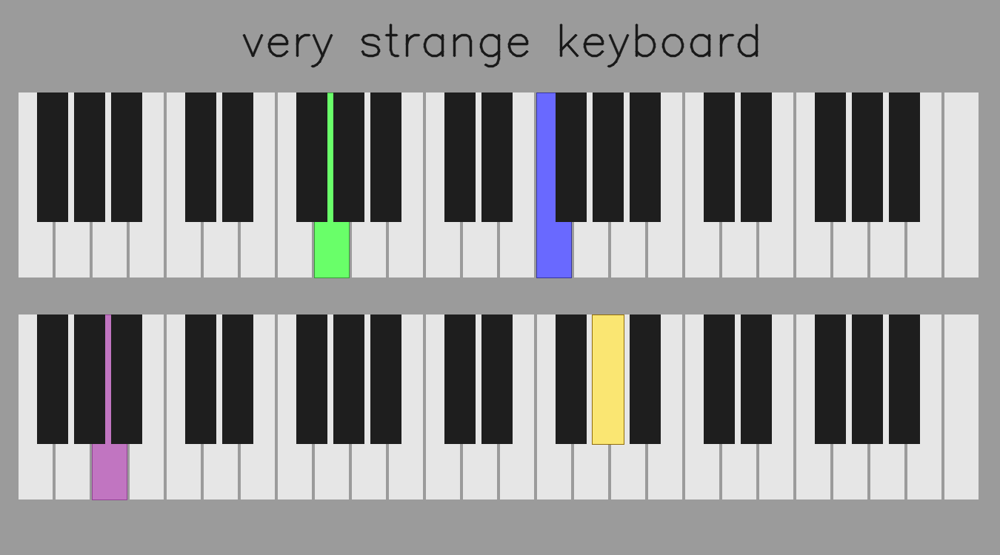

# python_midi
My struggles with MIDI, with using arduino and python

## versions - each of them is different type

### VERSION_01
  - description: *second way is to create python app, which can read from UART(arduino or something), and play sounds. It can be some GUI for that*
  - board: arduino unoR3 clone
  - lib: MIDI_controller (https://github.com/tttapa/MIDI_controller)
  - out: fake MIDI (UART)
  - audio app: python app --> python_mido_uart.py
  - keys number: 44 (12*4 - 4) (half of the keyboard)
  - GUI: False
  
### VERSION_02

  - description: *third way is to create arduino which works as MIDI device and sends data over USB*
  - to be done
  
### VERSION_03

  - description: *fourth way is to create arduino with MIDI connector*
  - to be done
  
### VERSION_04

  - description: *first way is to create binding for dll(loop_midi etc)*
  - to be done
  
  
## GUI - keyboard visualisation

